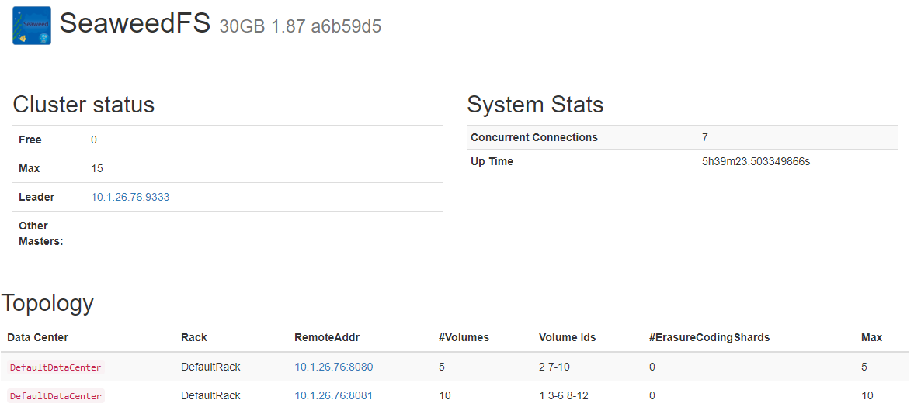
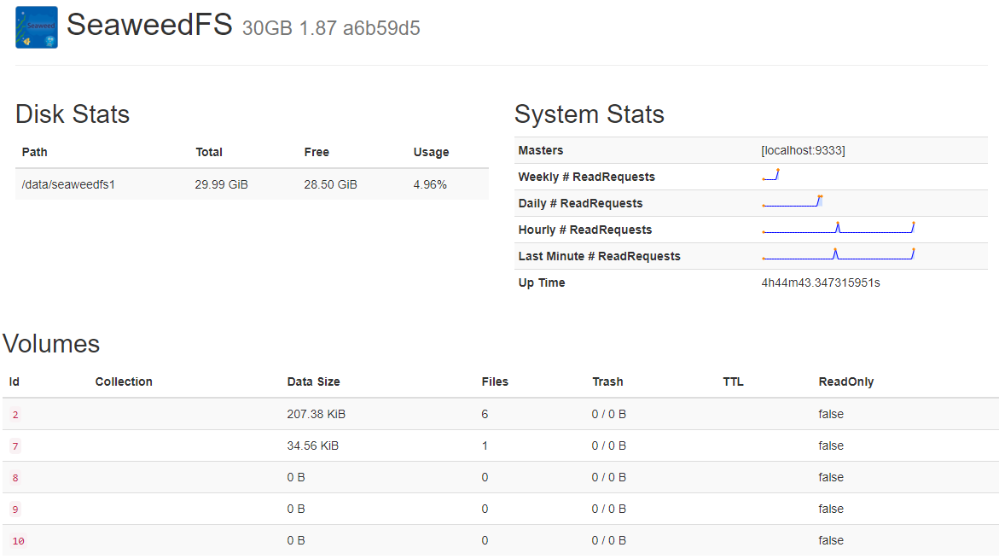
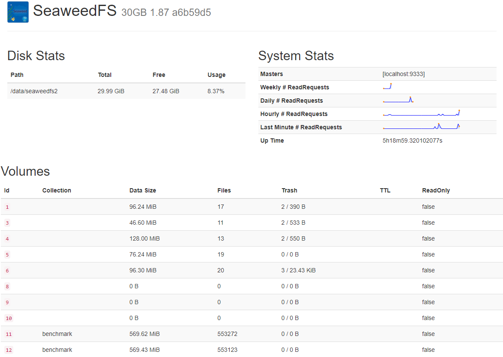
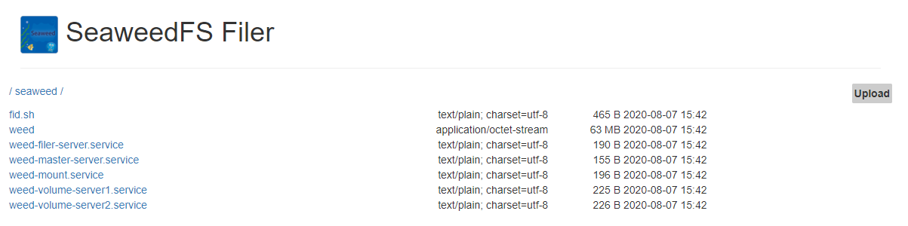

- [seaweed仓库地址](https://github.com/chrislusf/seaweedfs)
- [seaweed版本发布地址](https://github.com/chrislusf/seaweedfs/releases)








## 1.文件说明

### weed
seaweed二进制文件

### weed-master-server.service
master节点启动文件

## weed-volume-server1/2.service
volume服务启动文件

## weed-filer-server.service
filer服务启动文件

## weed-mount.service
挂载服务

## fid.sh(文件名暂定)
文件上传脚本

## 2.seaweed用法简介

### 2.1启动主服务器
```
> ./weed master
```

### 2.2启动卷服务器
```
> ./weed volume -dir="/tmp/data1" -max=5  -mserver="localhost:9333" -port=8080 &
> ./weed volume -dir="/tmp/data2" -max=10 -mserver="localhost:9333" -port=8081 &
```

### 2.3启动文件服务器
```
> ./weed filer -master="localhost:9333" -port=8888
```

## 3.上传文件
### 3.1未启动filer服务之前
要上传文件，请执行以下操作：首先，发送HTTP POST，PUT或GET请求/dir/assign以获取fid和卷服务器URL：
```
> curl http://localhost:9333/dir/assign
{"count":1,"fid":"3,01637037d6","url":"127.0.0.1:8080","publicUrl":"localhost:8080"}
```

其次，要存储文件内容，请url + '/' + fid从响应中发送HTTP多部分POST请求：
```
> curl -F file=@/home/chris/myphoto.jpg http://127.0.0.1:8080/3,01637037d6
{"name":"myphoto.jpg","size":43234,"eTag":"1cc0118e"}
```

### 3.2启动filer服务之后
```
# 上传文件，读取文件
curl -F file=@/root/test.txt http://localhost:8888/text/
curl "http://localhost:8888/text/test.txt"

# 以新的名称重命名上传后的文件
curl -F file=@/root/test.txt http://10.0.20.46:8888/text/new.txt
curl "http://localhost:8888/text/new.txt"

# 列表展示目录中的文件
visit "http://localhost:8888/path/to/sources/"

# 筛选目录中的文件
visit "http://localhost:8888/path/to/sources/?lastFileName=abc.txt&limit=50"

# 删除文件
curl -X DELETE "http://localhost:8888/text/new.txt"

# 递归删除路径下所有的文件以及目录
curl -X DELETE http://localhost:8888/path/to/dir?recursive=true
# 递归删除所有的文件以及目录，忽略递归错误
curl -X DELETE http://localhost:8888/path/to/dir?recursive=true&ignoreRecursiveError=true
```

## 4.参考
- [seaweedfs搭建与使用](https://blog.wangqi.love/articles/seaweedfs/seaweedfs%E6%90%AD%E5%BB%BA%E4%B8%8E%E4%BD%BF%E7%94%A8.html)

